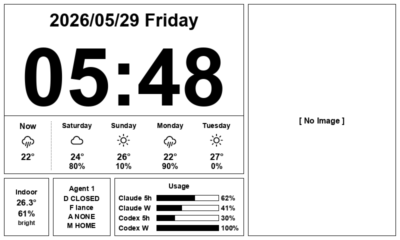

# ePaper Home Display

以 Raspberry Pi Zero 2W 驅動 Waveshare 7.5" 電子紙顯示器的智慧家庭狀態面板，整合溫濕度、光線感測、安全偵測與天氣資訊，並與 Agent 1 透過 MQTT 協同工作。



---

## 功能特色

- **天氣面板**：即時天氣 + 5 天預報（OpenWeatherMap），含天氣圖示與溫度
- **室內環境**：DHT22 溫濕度 + 光線感測器（MCP3008 ADC）
- **家庭占用偵測**：依光線、門事件、人臉辨識加權計分，判斷 OCCUPIED / UNOCCUPIED
- **安全整合**：接收 Agent 1 的門鈴、人臉、告警 MQTT 事件，輸出 ALARM / INVESTIGATE / IGNORE 決策
- **AI 使用量顯示**：顯示 Claude 5h、Codex 5h 與 Codex 週配額使用百分比，搭配 ai-usage-collector 工具
- **WebUI 設定介面**：瀏覽器設定介面，支援互動地圖選點、MQTT 設定、占用度調參
- **Discord 通知**：安全告警推送（⚠️ 服務架構已就緒，尚未連接至告警流程）
- **音效提醒**：天氣提醒播報（aplay + USB 音箱）
- **事件日誌**：SQLite 記錄所有環境、門、人臉、告警、AI 使用量事件

---

## 硬體需求

| 元件 | 型號 | 說明 |
|------|------|------|
| 單板電腦 | Raspberry Pi Zero 2W | 運行主服務 |
| 顯示器 | Waveshare 7.5" e-Paper V2 | 800×480，黑白 |
| 溫濕度感測器 | DHT22 | GPIO 4（BCM） |
| 光線感測器 | 光敏電阻 + MCP3008 ADC | SPI CE1（GPIO 7） |
| 按鈕 | 任意常開按鈕 | GPIO 27（BCM） |
| 音效輸出 | USB 音箱 / USB 喇叭 | micro USB OTG 轉接 |

---

## 快速開始

### 1. 筆電（開發 / 單元測試）

```bash
git clone https://github.com/Ning0612/epaper-home-display.git
cd epaper-home-display
python -m venv .venv

# Windows
.venv\Scripts\pip install -r requirements.txt

# macOS / Linux
.venv/bin/pip install -r requirements.txt

# 執行所有單元測試（mock 硬體，不需要 Pi）
pytest
```

### 2. Raspberry Pi（部署）

```bash
# Pi 上 clone 並安裝
git clone https://github.com/Ning0612/epaper-home-display.git ~/epaper-home-display
cd ~/epaper-home-display
python3 -m venv .venv
.venv/bin/pip install -r requirements.txt
.venv/bin/pip install adafruit-circuitpython-dht spidev RPi.GPIO gpiozero

# 複製設定檔並填入必要金鑰
cp config.example.yaml config.yaml
nano config.yaml   # 至少填入 mqtt.broker_host 和 weather.api_key

# 下載 Waveshare 驅動（repo 未包含）
cd lib/waveshare_epd
wget https://raw.githubusercontent.com/waveshare/e-Paper/master/RaspberryPi_JetsonNano/python/lib/waveshare_epd/epd7in5_V2.py
wget https://raw.githubusercontent.com/waveshare/e-Paper/master/RaspberryPi_JetsonNano/python/lib/waveshare_epd/epdconfig.py

# 安裝並啟動 systemd 服務
sudo cp systemd/epaper-home-display.service /etc/systemd/system/
sudo systemctl daemon-reload
sudo systemctl enable --now epaper-home-display

# 確認服務狀態
systemctl status epaper-home-display --no-pager
journalctl -u epaper-home-display -n 50 --no-pager
```

WebUI 設定介面：`http://<Pi_IP>:8000/settings`

---

## 文件索引

| 文件 | 說明 |
|------|------|
| [docs/architecture.md](docs/architecture.md) | 系統架構、模組分層、asyncio 協程設計、資料流 |
| [docs/configuration.md](docs/configuration.md) | 所有設定項目說明、預設值、config.local.yaml 用法 |
| [docs/development.md](docs/development.md) | 本機開發環境、測試、mock 機制、擴充指南 |
| [docs/deploy-and-test.md](docs/deploy-and-test.md) | Pi 首次部署、日常更新、SSH 金鑰設定、硬體測試 |
| [docs/hardware-wiring.md](docs/hardware-wiring.md) | 完整硬體接線圖與 GPIO 腳位說明 |
| [docs/mqtt-protocol.md](docs/mqtt-protocol.md) | MQTT 主題清單與 JSON 訊息格式規範 |
| [docs/webui.md](docs/webui.md) | WebUI 設定介面完整使用說明與 REST API 參考 |
| [tools/ai-usage-collector/README.md](tools/ai-usage-collector/README.md) | AI 使用量採集工具（Node.js）說明 |

---

## 架構概覽

```
筆電（開發）                Raspberry Pi Zero 2W
─────────────               ──────────────────────────────────────────────
編輯程式碼                   app/main.py（asyncio 5 協程）
跑單元測試（mock）              ├── _sensor_loop()    → DHT22, 光線（每 30 秒）
git push                        ├── _presence_loop()  → 占用計分, 告警決策（每 60 秒）
                                ├── _display_loop()   → e-Paper 更新（牆鐘 :57）
Agent 1（MQTT）                 ├── _weather_loop()   → OpenWeatherMap（每 600 秒）
─────────────                   └── server.serve()    → FastAPI WebUI（:8000）
home/security/*  →
                                app/ 層架構：
← home/home_state/* (計劃中)     sensors/ → display/ → logic/ → services/ → storage/
                                                ↕
                                           state.py（全局狀態）

ai-usage-collector              SQLite（data/*.db）
（筆電 Node.js 工具）            └── 8 張資料表：環境、門、人臉、告警、AI 使用量等
POST /ai_usage  →
```

---

## 系統需求

- **Python 3.11+**（開發與 Pi）
- **Pi OS Bookworm / Trixie**（部署目標）；Windows / macOS / Linux（開發端）
- **MQTT Broker**（如 Mosquitto，建議部署在區域網路內）
- **OpenWeatherMap API Key**（免費方案即可，每日 1000 次請求限額）

---

## 相關專案

- **Agent 1**：門鈴攝影機 + 人臉辨識端，透過 MQTT 發布安全事件至本專案
- **ai-usage-collector**：採集 Claude CLI / Codex CLI 使用量，透過 `/ai_usage` 端點推送至 Pi，顯示於 e-Paper 面板
