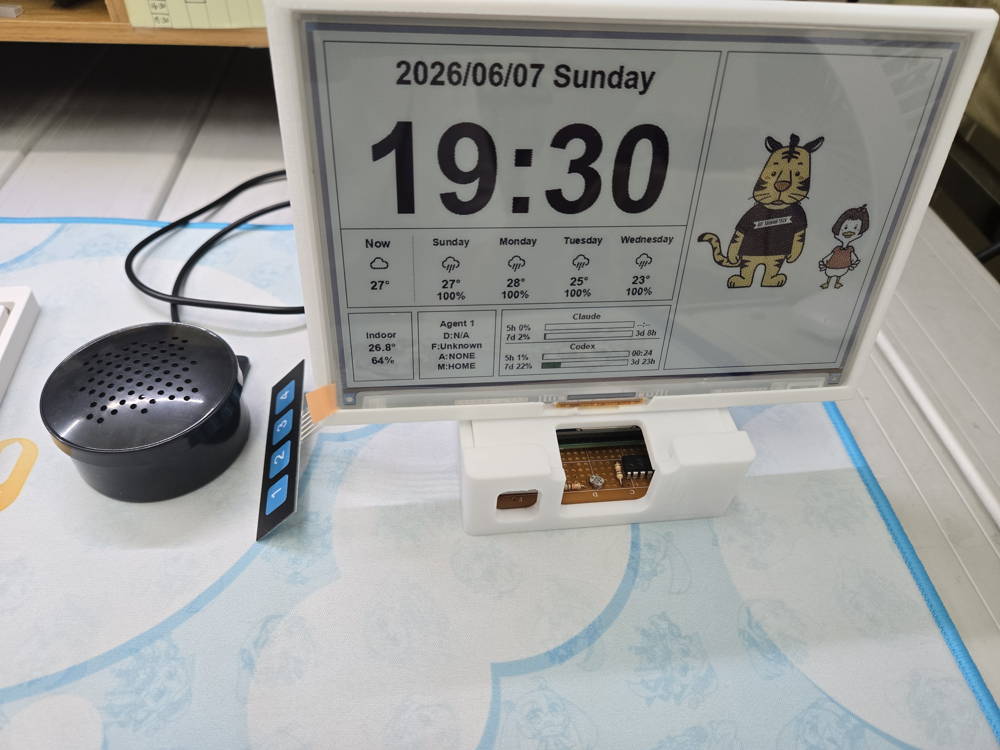
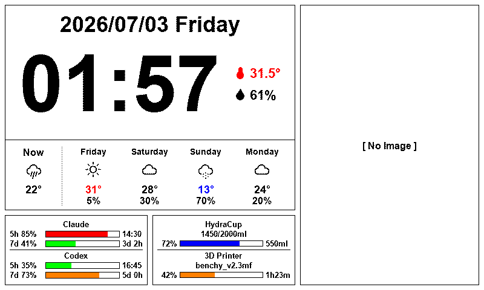
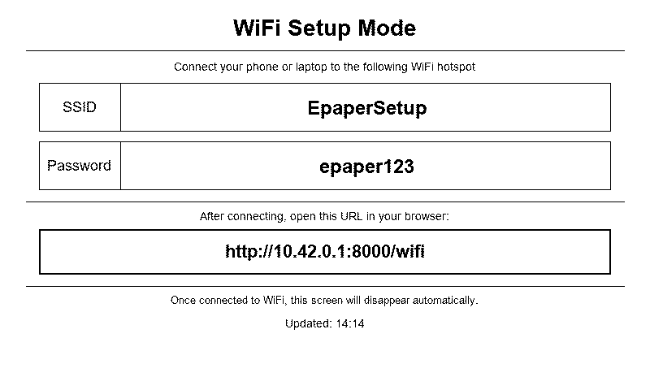

# ePaper Home Display

[](https://www.python.org/)
[](https://www.raspberrypi.com/)
[](https://fastapi.tiangolo.com/)
[](https://www.sqlite.org/)
[](https://python-pillow.org/)
[](https://docs.python.org/3/library/asyncio.html)
[](https://github.com/Ning0612/epaper-home-display/actions/workflows/ci.yml)
[](LICENSE)

以 Raspberry Pi Zero 2W 驅動 Waveshare 7.3" 七色 e-Paper 顯示器（epd7in3e）的智慧家庭狀態面板，整合溫濕度、光線感測、天氣資訊與 MQTT 裝置狀態，並顯示 Claude / Codex AI 使用量、飲水 / 3D 列印進度與自訂圖片輪播。

> **課程專案**：國立臺灣科技大學｜114.2｜EE5325701｜物聯網系統應用與設計實務｜期末專案

## 專案狀態

本專案源自 114.2 臺科 EE5325701「物聯網系統應用與設計實務」期末專案；`archive/final-project` 分支保留期末繳交版本，`main` 分支是後續整理後的獨立版本。若有新的功能發想或實際使用需求，會以興趣延伸專案持續維護。

## 實體照片

<p align="center">
  
</p>

## Demo 片段

<p align="center">
  
</p>

上方 GIF 串接三支短情境 demo 的完整內容（壓縮預覽）；期末總 Demo 與高品質版本請看下方 MP4 連結。

完整 demo 影片：

- [期末總 Demo 影片](docs/demo/system-demo.mp4)
- [電子紙資訊顯示 - 圖片切換](docs/demo/image-switch.mp4)
- [電子紙 - 主動切監視器畫面 / 主動發警報 / 取消警報](docs/demo/active-monitor-alert-cancel.mp4)
- [電子紙 - 收到警報自動切監視器畫面 / 選擇發警報 / 取消警報](docs/demo/auto-monitor-alert-cancel.mp4)

## 畫面預覽

### 儀表板（Dashboard）



主畫面，每分鐘自動更新。左側顯示日期時間（時鐘右方以圖示顯示室內溫濕度）、天氣（即時 + 4 天預報）；左下方為 Claude / Codex AI 使用量進度條（附重置時間）與飲水進度；右側為圖片輪播區。

### WiFi 設定模式（AP Mode）



Pi 無法連上 WiFi 時自動顯示此頁，引導用戶直接連接 SSID 並透過捕獲入口網站（`http://10.42.0.1:8000/wifi`）完成設定。完成後自動切回儀表板。

> 預覽圖由 `scripts/preview_render.py` 以 mock 資料生成，輸出至 `docs/images/`。

---

## 功能特色

- **天氣面板**：即時天氣 + 5 天預報（OpenWeatherMap），含天氣圖示與溫度
- **室內環境**：DHT22 溫濕度 + 光線感測器（MCP3008 ADC）
- **家庭占用偵測**：純光線感測，燈亮 → OCCUPIED，燈暗 → UNOCCUPIED；無人在場時暫停面板更新，偵測到回家時立即喚醒顯示更新
- **AI 使用量顯示**：直接透過 OAuth 向 Anthropic 與 OpenAI API 輪詢 Claude / Codex 5h 及 7d 使用量，顯示於 e-Paper 面板底部
- **HydraCup 飲水進度**：透過本機 Mosquitto MQTT broker 接收 esp32-hydracup 每日飲水量，顯示目前飲水量 / 目標量與剩餘量（協定見 `docs/hydracup-mqtt-protocol.md`）
- **Bambu Lab 3D 印表機進度**：透過 Bambu Lab 官方雲端 MQTT（獨立於本機 Mosquitto，不需 LAN Only Mode）取得任務名稱、進度百分比與剩餘時間，顯示於儀表板（協定見 `docs/bambu-mqtt-protocol.md`）
- **圖片輪播**：上傳自訂圖片，支援裁切、旋轉、翻轉、Floyd-Steinberg dithering，顯示於 e-Paper 面板
- **桌面工作時段**：自動追蹤在場時段、記錄每日統計、離場時推送 Discord 摘要
- **WebUI 設定介面**：密碼保護的瀏覽器設定介面，支援互動地圖選點、圖片管理
- **Discord 通知**：裝置上線、桌面時段結束、每日統計推送
- **音效播放**：aplay + USB 音箱（目前為 dormant，僅供 WebUI 手動測試，未被任何自動事件觸發）
- **事件日誌**：SQLite 記錄環境、圖片、工作時段、通知等事件（AI 使用量僅快取於記憶體，不持久化）

---

## 硬體需求

| 元件 | 型號 | 說明 |
|------|------|------|
| 單板電腦 | Raspberry Pi Zero 2W | 運行主服務 |
| 顯示器 | Waveshare 7.3" e-Paper (E) / Waveshare 7.5" e-Paper V2 | 透過 `display.model` 選擇 `epd7in3e`（800×480，七色：黑、白、紅、黃、藍、綠、橙）或 `epd7in5_V2`（800×480，黑白雙色，支援 dirty-region 局部刷新）；完整設定見 [docs/configuration.md](docs/configuration.md) |
| 溫濕度感測器 | DHT22 | GPIO 4（BCM） |
| 光線感測器 | 光敏電阻 + MCP3008 ADC | SPI CE1（GPIO 7） |
| 按鈕（×4，1 個作用中）| 任意常開按鈕 | GPIO 5（B1，作用中）/ 6（B2）/ 27（B3）/ 22（B4，接腳保留未綁定）|
| 音效輸出 | USB 音箱 / USB 喇叭 | micro USB OTG 轉接 |

---

## 快速開始

### 1. 筆電（開發 / 單元測試）

```bash
git clone https://github.com/Ning0612/epaper-home-display.git
cd epaper-home-display
python -m venv .venv

# Windows
.venv\Scripts\pip install -r requirements.txt

# macOS / Linux
.venv/bin/pip install -r requirements.txt

# 執行所有單元測試（mock 硬體，不需要 Pi）
pytest
```

### 2. Raspberry Pi（部署）

```bash
# Pi 上 clone 並安裝
git clone https://github.com/Ning0612/epaper-home-display.git ~/epaper-home-display
cd ~/epaper-home-display
python3 -m venv .venv
.venv/bin/pip install -r requirements.txt
.venv/bin/pip install adafruit-circuitpython-dht spidev RPi.GPIO gpiozero

# 複製設定檔並填入必要金鑰
cp config.example.yaml config.yaml
nano config.yaml   # 至少填入 weather.api_key

# 安裝並啟動 systemd 服務
sudo cp systemd/epaper-home-display.service /etc/systemd/system/
sudo systemctl daemon-reload
sudo systemctl enable --now epaper-home-display

# 確認服務狀態
systemctl status epaper-home-display --no-pager
journalctl -u epaper-home-display -n 50 --no-pager
```

WebUI 設定介面：`http://<Pi_IP>:8000/settings`

**（選用）啟用 AI 使用量顯示**：在筆電執行 OAuth 授權工具，再將憑證 scp 到 Pi：

```bash
# 在筆電執行
python tools/claude_auth.py   # 產生 data/claude_creds.json
python tools/codex_auth.py    # 產生 data/codex_creds.json

# 複製到 Pi
scp data/claude_creds.json pi@epaper-display.local:~/epaper-home-display/data/
scp data/codex_creds.json  pi@epaper-display.local:~/epaper-home-display/data/
```

---

## 文件索引

| 文件 | 說明 |
|------|------|
| [docs/architecture.md](docs/architecture.md) | 系統架構、模組分層、asyncio 協程設計、資料流 |
| [docs/configuration.md](docs/configuration.md) | 所有設定項目說明、預設值、config.local.yaml 用法 |
| [docs/development.md](docs/development.md) | 本機開發環境、測試、mock 機制、擴充指南 |
| [docs/deploy-and-test.md](docs/deploy-and-test.md) | Pi 首次部署、日常更新、SSH 金鑰設定、硬體測試 |
| [docs/hardware-wiring.md](docs/hardware-wiring.md) | 完整硬體接線圖與 GPIO 腳位說明 |
| [docs/webui.md](docs/webui.md) | WebUI 設定介面完整使用說明與 REST API 參考 |
| [tools/README.md](tools/README.md) | Claude / Codex OAuth 憑證設定工具說明 |
| [THIRD_PARTY_LICENSES.md](THIRD_PARTY_LICENSES.md) | 第三方元件授權聲明（weather icons / Waveshare driver / DejaVu fonts）|

---

## 架構概覽

```
筆電（開發）                Raspberry Pi Zero 2W
─────────────               ──────────────────────────────────────────────
編輯程式碼                   app/main.py（asyncio 9 協程）
跑單元測試（mock）              ├── _sensor_loop()         → DHT22, 光線（每 30 秒）
git push                        ├── _presence_loop()       → 占用計分（每 60 秒）
                                ├── _display_loop()        → e-Paper 更新（牆鐘 :57）
                                ├── _weather_loop()        → OpenWeatherMap（每 600 秒）
                                ├── _claude_usage_loop()   → Claude 使用量（每 600 秒）
                                ├── _codex_usage_loop()    → Codex 使用量（每 600 秒）
                                ├── _notification_loop()   → Discord 排程通知
                                ├── _wifi_monitor_loop()   → WiFi 模式監測（每 10 秒）
                                └── server.serve()         → FastAPI WebUI（:8000）

                                app/ 層架構：
                                   sensors/ → display/ → logic/ → services/ → storage/
                                                ↕
                                           state.py（全局狀態）

                                SQLite（data/*.db）
                                └── 10 張資料表：環境、圖片、桌面時段、通知等
                                        （另有 3 張已退役的 Agent 1 整合遺留 schema，
                                         程式碼不再寫入，僅保留避免刪除既有歷史資料）
```

---

## 系統需求

- **Python 3.11+**（開發與 Pi）
- **Pi OS Bookworm / Trixie**（部署目標）；Windows / macOS / Linux（開發端）
- **OpenWeatherMap API Key**（免費方案即可，每日 1000 次請求限額）

---

## 課程資訊

本專案原為期末作業，實作與驗證課程所學物聯網系統整合設計概念，涵蓋嵌入式 Linux、感測器驅動與異步服務設計。期末繳交版本保存於 `archive/final-project` 分支；`main` 分支後續移除了課程要求的 Agent 1（門鈴攝影機 + 人臉辨識，MQTT 協同）整合，僅保留獨立自主的功能。

| 項目 | 說明 |
|------|------|
| 課程 | EE5325701 物聯網系統應用與設計實務（Design and Application in Internet of Things）|
| 學期 | 114-2（2026 春季）|

---

## 授權

本專案採用 [MIT 授權條款](LICENSE)。
